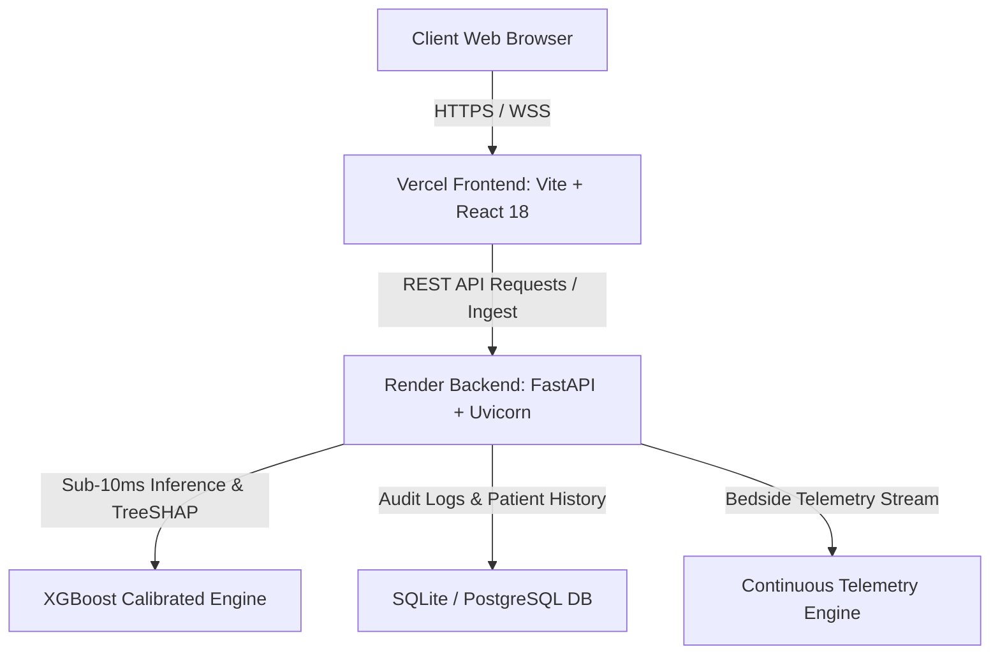

# HAI-SENTINEL: Complete Production & Cloud Deployment Guide
**National-Level Hackathon Track: Omni_BioTech_9 — Hospital-Acquired Infection Intelligence**

---

## 📑 Architecture Overview

HAI-Sentinel is built using a decoupled modern microservice architecture:
- **Backend API & ML Engine**: FastAPI (Python 3.11), SQLAlchemy, Scikit-Learn, XGBoost, TreeSHAP, Uvicorn.
- **Frontend Command Center**: React 18, TypeScript, Tailwind CSS, Vite, Lucide Icons, Recharts.
- **Continuous Telemetry & Triage Engine**: Real-time multi-bed telemetry streaming (`/api/telemetry/live-feed`), instant sub-10ms risk inference (`/api/telemetry/triage-calculator`), and longitudinal SQLite/PostgreSQL persistence.



---

## 1. 🐙 Deploying with GitHub (Repository & CI/CD)

### Step 1.1: Initialize Git and Push to GitHub

1. Open your terminal in the project root directory (`d:/Omnikon Project`):
   ```bash
   git init
   git add .
   git commit -m "feat: complete HAI-Sentinel production app with real-time telemetry, dual dark/light UI, and full ML pipeline"
   ```

2. Create a new repository on GitHub (e.g. `https://github.com/YOUR_USERNAME/hai-sentinel`).

3. Link and push to GitHub:
   ```bash
   git remote add origin https://github.com/YOUR_USERNAME/hai-sentinel.git
   git branch -M main
   git push -u origin main
   ```

### Step 1.2: Automated GitHub Actions CI/CD Pipeline
The repository includes `.github/workflows/ci.yml`. On every `git push` or `pull_request`, GitHub automatically:
- Sets up Python 3.11, installs all requirements, trains the ML models, seeds the database, and runs the **22-test pytest suite**.
- Sets up Node.js 20, runs TypeScript lint/typechecks, and compiles the production frontend bundle.

---

## 2. ⚡ Deploying Backend on Render (FastAPI + ML Engine)

Render provides free hosting for Python FastAPI web services.

### Step 2.1: Automatic Deployment via `render.yaml` (Recommended)
1. Log in to [Render.com](https://render.com).
2. Click **Blueprints** &rarr; **New Blueprint Instance**.
3. Select your GitHub repository (`YOUR_USERNAME/hai-sentinel`).
4. Render will detect `render.yaml` and configure:
   - **Build Command**: `pip install --upgrade pip && pip install -r requirements.txt && python -m ml.train && python -m backend.database_seeder`
   - **Start Command**: `uvicorn backend.main:app --host 0.0.0.0 --port $PORT --workers 2`
5. Click **Apply**. Render will build and deploy your API in ~2 minutes.

### Step 2.2: Manual Web Service Setup on Render
If configuring manually:
1. On the Render Dashboard, click **New +** &rarr; **Web Service**.
2. Connect your GitHub repository.
3. Set the following parameters:
   - **Name**: `hai-sentinel-api`
   - **Language**: `Python 3`
   - **Region**: `Oregon (US West)` or nearest region.
   - **Branch**: `main`
   - **Build Command**:
     ```bash
     pip install --upgrade pip && pip install -r requirements.txt && python -m ml.train && python -m backend.database_seeder
     ```
   - **Start Command**:
     ```bash
     uvicorn backend.main:app --host 0.0.0.0 --port $PORT
     ```
4. Add **Environment Variables**:
   | Variable | Value |
   |---|---|
   | `PYTHON_VERSION` | `3.11.9` |
   | `ENVIRONMENT` | `production` |
   | `DATABASE_URL` | `sqlite:///./hai_sentinel.db` |
   | `CORS_ORIGINS` | `https://hai-sentinel.vercel.app,http://localhost:5173,http://localhost:3000` |
   | `DEMO_MODE` | `true` |
5. Click **Create Web Service**. Note your public Render URL (e.g. `https://hai-sentinel-api.onrender.com`).

---

## 3. ▲ Deploying Frontend on Vercel (React 18 + Vite)

Vercel provides global CDN edge hosting for modern Vite/React Single Page Applications.

### Step 3.1: Import Project on Vercel
1. Log in to [Vercel.com](https://vercel.com).
2. Click **Add New...** &rarr; **Project**.
3. Import your GitHub repository (`YOUR_USERNAME/hai-sentinel`).

### Step 3.2: Configure Build Settings
1. In the configuration screen:
   - **Framework Preset**: `Vite`
   - **Root Directory**: Click *Edit* and select `frontend` (or leave as root if using the root `vercel.json`).
   - **Build Command**: `npm run build`
   - **Output Directory**: `dist`
   - **Install Command**: `npm install`

2. Add **Environment Variables**:
   | Variable | Value | Description |
   |---|---|---|
   | `VITE_API_URL` | `https://hai-sentinel-api.onrender.com` | Your Render Backend API URL |

3. Click **Deploy**. Vercel will build the frontend and provide your live application URL (e.g., `https://hai-sentinel.vercel.app`).

---

## 4. 🐳 Local Full-Stack Deployment with Docker

To run the entire stack locally in isolated Docker containers:

```bash
# Build and launch both Backend (port 8000) and Frontend (port 5173)
docker-compose up --build
```
- Open Frontend: [http://localhost:5173](http://localhost:5173)
- Open Backend API Docs: [http://localhost:8000/docs](http://localhost:8000/docs)

---

## 5. 💻 Running Locally for Development

### Backend Setup:
```bash
# 1. Open Terminal in Root Directory
cd "d:/Omnikon Project"

# 2. Install dependencies
pip install -r requirements.txt

# 3. Train models and seed SQLite database
python -m ml.train
python -m backend.database_seeder

# 4. Start FastAPI server with live reload
uvicorn backend.main:app --reload --port 8000
```

### Frontend Setup:
```bash
# 1. Open a second Terminal
cd "d:/Omnikon Project/frontend"

# 2. Install packages
npm install

# 3. Launch Vite development server
npm run dev
```
Open [http://localhost:5173](http://localhost:5173) in your browser.

---

## 6. 🏆 Features to Highlight During Hackathon Evaluation

| Feature | Key Evaluation Criteria Addressed | How to Showcase |
|---|---|---|
| **Dual Theme Support** | UI/UX Accessibility | Click the ☀️ / 🌙 button in the top navbar to toggle between Command Center Dark and Clinical Light modes. |
| **Adjustable Typography** | UI/UX Readability | Click `A`, `A+`, `A++` in the navbar to dynamically scale font size from 100% to 130% across all charts and cards. |
| **Live Telemetry & Triage Studio** | Real-Time Technical Innovation | Adjust physiological sliders (Temp, WBC, Lactate, CVC Hours) on the Dashboard and watch sub-10ms risk and TreeSHAP waterfall compute in real-time. |
| **Longitudinal Trajectory Calculus** | Scientific Innovation | Inspect patient DEMO-1042 to view 12-hour velocity derivatives ($v_{12\text{h}}$) and temporal acceleration ($a_{12\text{h}}$). |
| **Spatial Cluster Radar** | Epidemiological Prevention | Explore the Unit Heatmap and Cluster Anomaly Radar to see algorithmic multi-bed contagion signals. |
| **90-Second Guided Demo Tour** | Presentation & Self-Sufficiency | Click **Launch 90s Guided Demo** or navigate to `/demo` for an automated, offline-ready deterministic walkthrough. |
| **Immutable Audit Trail** | Clinical Governance & Compliance | Review `/audit` to verify cryptographic recording of all model inferences and nurse bedside interventions. |

---

*Generated for HAI-Sentinel • Omni_BioTech_9 Hackathon Submission • All rights reserved.*
